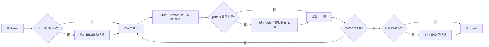

# 0x01 sed：流编辑器（Stream Editor）

`sed` 是 Linux 下常用的流式文本编辑器，用于对输入数据逐行匹配、**替换、删除或插入**操作，常用于自动化文本处理脚本中。

`sed`的处理逻辑可以简化为下面几步：

1. 一次从输入数据中读取一行；  
2. 根据所提供的编辑命令匹配数据；  
3. 按照命令修改该行内容；  
4. 将新结果输出到标准输出（STDOUT）。  
> ⚠️ 默认不会写回原文件，除非使用 `-i` 参数。

## 命令使用

`sed options script file`

- 参数内容

| Options     | Description                                       |
| ----------- | ------------------------------------------------- |
| `-e script` | 处理输入时，将scripts中指定命令添加到已有命令中   |
| `-f file`   | 将file中的命令添加到已有命令中                    |
| `-n`        | 取消将结果输出到STDOUT，需要使用print命令完成输出 |

```shell
# 命令行方式
sed -e 's/brown/green/; s/dog/cat/' data.txt

# 在file.txt中添加如下两行
# s/brown/green/
# s/dog/cat/

# 文件方式
sed -f file.txt data.txt
```

## 替换标记

默认只替换每行第一处，使用标记替换（substitution flag）可以指定替换位置`s/pattern/replacement/flags`，具体有四种替换标记：数字、g、p、w 

## 行寻址

`[address]command`或以如下方式使用行选址

```shell
address{
 command1
 command2
 command3
}
```

# 0x02 Gawk: GNU 项目对 awk 语言的实现

Gawk 是 GNU 对 AWK 语言的实现，符合 POSIX 1003.1 标准。

AWK 语言本质是**一种基于模式匹配和动作执行的文本处理语言**。AWK 以**行为单位读取文本输入**，并在每一行上执行用户定义的操作。

AWK 可以作为一种**轻量级的结构化编程语言**，用于**提取与统计**，文件分析，报表生成任务。

一份完整的 AWK 程序的通常遵循下面的结构：

```awk
pattern { action statements }

function name(parameter list) {
    statements
}
```

在 shell 中的 Gawk 命令则通常使用行内脚本来引入 AWK 程序：

```shell
# 例如读取一份日志文件，匹配“error”，并打印整行
awk '/error/ { print $0 }' logfile.txt
```

Gawk 的命令也往往可以分为三个部分：

- Gawk 命令参数
- AWK 代码中的**模式匹配语句**
- AWK 代码中的**数据操作语句**

## AWK 程序的读取与执行顺序

Gawk 工具按以下优先级读取 AWK 源代码：

- 从命令行指定的 程序文件（`-f program-file`）
- 从命令行的 `--source` 参数
- 从命令行第一个 非选项参数（即不是 `-` 开头的参数）。

当命令中多次使用 `-f` 或 `--source`，Gawk 解释器会将所有指定的源码视为拼接后的一整段程序。

Gawk 工具的执行流程可以参照下面这份流程图：



### 最佳实践

1. 可以把常用函数写入独立的 AWK 库文件，然后在新程序中通过 `-f` 引入；
2. 可以在命令行中混合使用内联代码与外部函数库。

## Gawk 命令参数 & 常用系统变量

Gawk 命令格式：

```shell
awk [-F fs] [-v var=value] [-f progfile | 'prog'] [file ...]
```

命令允许使用下面这些参数：

- Field Separator: `-F fs` 设定分隔符
- Program File：`-f file` 通过文件读取 AWK 程序，可以多次指定
- Value Assign：`-v var=val` 设定程序环境变量
- Optimize：`-O` 可以开启 AWK 程序的内部解释优化
- Word：`-W` 后可以使用一系列为了兼容 POSIX 模式而设计的功能
  - Traditional/Compat：是否使用兼容模式，GNU 扩展功能
  - Profile：`-W profile=<prof_file>` 指定输出格式
  - Regex Interval：`-W re-interval`启用正则表达式中的**区间表达式**功能。区间表达式在传统的 AWK 语言中并不可用。POSIX 标准为了让 awk 与 egrep 的行为保持一致，增加了该特性。
  - Source Program：`-W source program-text` 将 program-text 作为 AWK 程序源码使用
  - Locale Numeric：`-W use-lc-numeric`强制 gawk 在解析输入数据时使用当前系统区域（locale）定义的小数点符号
  - version：在标准输出（STDOUT）上打印当前 gawk 的版本信息

AWK 代码中可以使用的自带系统变量：

- `$0`：输出整行
- `$1, $2...`：指定字段
- `NF`：本行字段数目
- `NR`：当前累计处理的行号，单个文件时同`FNR`一样，多个文件时计算累计值
- `FNR`：文件中的行号
- `FILENAME`：文件名

## 模式匹配语句

模式匹配语句 通常包括逻辑运算和 “BEGIN“ 以及 ”END“ 两个关键字。可以是下列任意一种。更加详细的 pattern 编写可以参照 `egrep` 命令中正则的使用。

- 关键字：
  - `BEGIN { ... }` 程序执行前
  - `{ ... }`：主处理逻辑；
  - `END { ... }`：文件处理结束后。
- 逻辑运算：
  - `pattern && pattern`：与运算
  - `pattern || pattern`：或运算
  - `! pattern`：非运算
- 条件匹配与范围选择：
  - `pattern1, pattern2`匹配从 pattern1 到 pattern2 之间的行
  - `condition ? pattern1 : pattern2`：条件表达式
  - `condition`：比较运算，如 `$NF > 0`

使用案例可以参考下面的模版：

```shell
# BEGIN: 开始处理数据前要运行的脚本
awk 'BEGIN {print "New Data Contents"} {print $0}' temp.txt

# END: 处理完成后，要运行的脚本
awk 'BEGIN {print "The data File COntents:"} \
{print $0} \
END {print "End of File"}' temp.txt
```

## 数据操作语句

AWK 语言本身是一个结构相对完备的，使用解释器运行的语言。其**数据操作语句**支持变量定义、条件判断、循环、函数等基本功能。

具体而言，数据操作语句的应该知道下面两种特性：

### 基本数据类型

AWK 是一种“弱类型、自动类型转换”的脚本语言。

AWK 内部的数据类型系统基本就三种：数值型（Number）、字符串型（String）、关联数组（Associative Array）。

其他类型都是通过这几种类型转化而来，如 AWK 没有布尔类型，逻辑判断由数值或字符串隐式转换。

### 数据操作语句

所有 AWK 语句的功能基本可以囊括在下面几个大类：
  - 控制语句：判断和循环
  - IO语句：如`print`
  - 用户自定义函数
  - 数学运算
  - 字符运算
  - 时间函数
  - 位运算

常用的基础语句和结构都可以在[gawk man page](https://linux.die.net/man/1/gawk)中查找。

不过如果要在 AWK 代码中使用用户自定义函数，使用较为特殊的定义位置和方法：

```awk
function f(p, q, a, b)
# a and b are local
{
...
}
/abc/ { ... ; f(1, 2) ; ... }
```

**注意**：每个参数（即使未传入实参）都会被初始化，所以在函数内部可以直接安全地使用参数，不必担心“未定义”错误。参数初始化的默认值为：

- 上下文中为字符串类型的参数：空字符串""
- 上下文中为数值类型的参数：数字 0

## Gawk 使用样例

1. 输出并给所有用户的用户名做分类

    ```awk
    BEGIN
    { FS = ":" }
    { print $1 | "sort" }

    # 计算一个文件的行数
    { nlines++ }
    END
    { print nlines }
    ```

2. 在文件中的每行前面加上编号
    ```awk
    { print FNR, $0 }
    ```

3. 在文件中的每行前面加上目前处理的行数
    ```awk
    { print NR, $0 }
    ```

4. 使用`nmap`从指定网页访问记录中，寻找当前活跃的终端数目
    ```shell
    tail -f access_log | \
    awk '/myhome.html/ \
    { system("nmap " $1 ">> logdir/myhome.html") }'
    ```

---

## Reference

- [gawk(1) - Linux man page](https://linux.die.net/man/1/gawk)
- [gawk command in Linux with Examples](https://www.geeksforgeeks.org/linux-unix/gawk-command-in-linux-with-examples/)