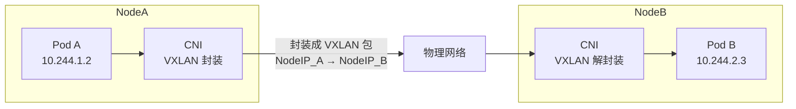
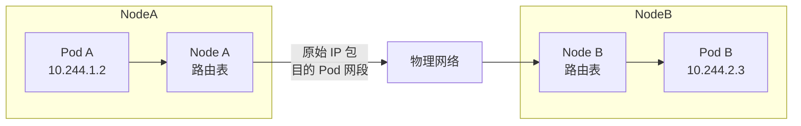
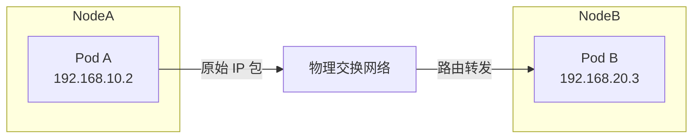
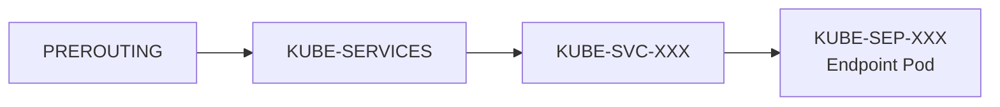
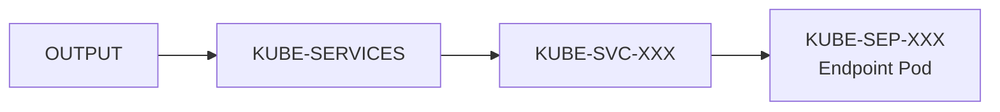
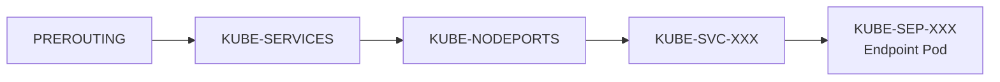
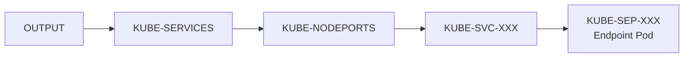

Kubernetes 升级过程中，除了需要为 apiserver 和 Nodes 上的 kubelet 进行升级，还需要升级三类核心组件。

## 0x01 k8s 升级中的核心组件

- **CNI**，Container Network Interface，容器接口插件，负责在 Node 上构建 Pod 对外的通信。
- **kube-proxy**，在 Node 上以 DeamonSet 方式存在，监听 apiserver 对 Service 的变更，支持通过 Service 对 Pod 的直接访问，在 Node 中实现 Service 负载均衡和服务发现。
- **CoreDNS**，从 1.21 版本开始用于代替 kube-dns，负责支持 k8s 集群内部的 DNS 查询服务。

## 0x02 CNI 使用与升级：以 Calico 为例

### 1. CNI 基础

CNI 概念起源于在物理节点上为容器构建网络环境的两种模型：Container Network Model（CNM）和 Container Network Interface（CNI）。

CNI 将系统抽象为 容器 和 网络 两个实体，核心目标就是为容器加入指定网络，并提供服务：

- 容器：拥有**独立 Linux 网络命名空间**的环境，例如使用 Docker 创建的容器。关键之处是容器需要拥有自己的 Linux 网络命名空间，这是加入网络的必要条件。
- 网络：表示可以互连的一组实体，这些实体拥有各自独立、唯一的IP地址，可以是**容器、物理机或者其他网络设备（比如路由器）**等。可以将容器添加到一个或多个网络中，也可以从一个或多个网络中删除。

### 2. CNI 工作流程

CNI 包含两个组件：**CNI Plugin** 和 **IPAM（IP Address Management）Plugin**。在 Pod 构建过程，CNI 需要在 Node 创建 容器运行时之前构建支持 Pod 对外访问的接口访问，为 Pod 调用底层网络通信构建一个通用接口标准，常见的 CNI 包括 Calico、Flannel、Cilium 等。

CNI 具体运行方法就是配置、下载、调用：

1. 首先在每个结点上设置 CNI 配置文件：`/etc/cni/net.d/xx-net.conf`。
2. 安装 CNI 配置文件中所对应的二进制插件到：`/opt/cni/bin`。
3. 在这个节点上创建 Pod 之后，kubelet 就会根据 CNI 配置文件执行所安装的 CNI 插件。
4. kubelet 会自动完成 Pod 的网络配置。

在集群里面创建一个 Pod 的时候，首先会通过 apiserver 将 Pod 的配置写入。

apiserver 的一些管控组件（比如 Scheduler）会调度Pod到某个具体的节点上去，节点上 kubelet 监听到这个 Pod 的创建之后，会在本地进行初始化的操作。

当执行到创建 Pod 网络这一步骤时，kubelet 首先会读取刚才 node 创建时的配置文件，配置文件里面会声明所使用的是哪一个插件，然后去执行具体的 CNI 插件的二进制文件，再由 CNI 插件进入 Pod 的网络空间去配置 Pod 的网络。

配置完成之后，kuberlet 也就完成了整个 Pod 的创建过程，这个 Pod 就在线了。

实际工作中，在集群中，只要一条 kubectl 命令就可以完成二进制包从 master 到 worker 的分发、配置、安装：

```shell
kubectl create -f https://raw.githubusercontent.com/projectcalico/calico/v3.31.2/manifests/tigera-operator.yaml
```

### 3. CNI 选型

根据 Pod 与 Node 之间的网络构建方式，CNI 通常使用下面三种工作模式：

#### Overlay 模式：隧道/覆盖网络

Overlay 模式的典型特征是 Pod 使用独立于宿主机的虚拟 IP 网段，当 Pod 进行跨节点通信时，数据包会在源节点被封装（如 VXLAN），以 Node IP => Node IP 的形式通过底层物理网络传输，在目的节点再进行解封装。

该方式的好处在于它不要求底层网络感知 Pod 网段，也不依赖二层直连能力，仅要求节点之间具备三层 IP 可达性。Overlay 网络通常通过内核隧道机制实现，无需额外的物理网络资源。

典型的 CNI 实现包括 Flannel VXLAN、Calico VXLAN、Weave。



#### Route 模式：路由/非隧道网络

Route 模式下，Pod 与宿主机仍然使用不同的网段，但**跨节点通信不再通过隧道封装，而是依赖节点之间的三层路由转发**。

在该模式中，CNI 会在每个节点上维护到其他节点 Pod 网段的路由规则，通常通过 BGP 或静态路由的方式进行下发。当 Pod 发起跨节点通信时，数据包以原始 IP 包形式经由宿主机转发，通过物理网络路由到达目标节点。

该模式不依赖二层直连能力，但要求底层网络支持三层可达，并**允许节点之间进行路由传播。可以理解为 CNI 在节点上维护一个路由表。**

最典型的 CNI 实现就是 Calico Route 模式。



#### Underlay 模式：Direct/Cloud Native 模式

容器和宿主机位于同一层网络，两者拥有相同的地位。容器之间网络的打通主要依靠于底层网络。因此该模式是强依赖于底层能力的。

Pod IP 就是真实可路由 IP，典型实现包括 Calico BGP + 节点直连、Macvlan、IPVLAN 等。



#### CNI 模式对比

- 环境：部署环境分为虚拟化、主机、公有云，虚拟化条件下由于网络限制较多，Overlay 模式会更容易配置，例如 Flannel VXLAN、Calico VXLAN、Calico IPIP 等。本地主机条件下，网络可达性更好，Route 模式会更便于布置，例如 Calico BGP 等。虚拟化条件则需要优先考虑云厂商自身的方案，例如阿里云的 Terway，AWS 的 VPC CNI（aws-node）。
- 功能：功能主要点在支持定制安全规则，支持对集群外资源访问，支持服务发现与负载均衡。特别应当注意，例如对 Pod 的访问策略支持，Underlay 更适合支持对集群外资源的访问，但大部分 Underlay 模式 CNI 不支持 k8s 的服务发现与负载均衡。
- 性能：在创建速度与网络性能方面，Overlay 通常创建速度较快，但是Underlay 网络性能较好。

#### 实现一个 CNI

如果运行环境比较特殊，在社区里面又找不到符合要求的 CNI 插件，也可以开发一个的 CNI 插件。CNI 插件的实现通常包含两个部分：

- Node上的二进制 CNI 插件：负责配置 Pod veth 和 IP 地址，这一步配置完成之后相当于给 Pod 上插上了一条网线；
- Node上的 Daemon 进程：去管理 Pod 之间的网络打通：在给 Pod 配了 IP 地址以及路由表后，打通 Pod 之间的通信需要让每一个 Pod 的 IP 地址在集群里面都能被访问到。

具体要实施的功能包括：

Part 1.构建 Pod 上网络设施

- 给 Pod 添加 veth 网卡：通常我们会用一个 veth 这种虚拟网卡，一端放到 Pod 的网络空间，一端放到 Node 的网络空间，这样就实现了 Pod 与 Node 这两个命名空间的打通。
- 给 Pod 分配 IP 地址：**这个 IP 地址有一个要求，我们在之前介绍网络的时候也有提到，就是说这个 IP 地址在集群里需要是唯一的。**如何保障集群里面给 Pod 分配的是个唯一的 IP 地址呢？一般来说我们在创建整个集群的时候会指定 Pod 的一个大网段，按照每个节点去分配一个 Node 网段。
  - 比如说集群创建了一个 172.16.0.0/16 的网段用于存放 Pod IP，CNi 就可以给 Node 去分配一个 172.16.1.0/24 的段，从而保障每个节点上的地址是互不冲突的。
  - 每个 Pod 再从 Node 上的网段中再去顺序分配具体的 IP 地址，比如 Pod A 分配到了 172.16.1.1，Pod B 分配到了 172.16.1.2，这样就实现了在节点里面 IP 地址分配的不冲突，并且不同的 Node 又分属不同的网段，因此不会冲突。这样就给 Pod 分配了集群里面一个唯一的 IP 地址。
- 配置 veth 和路由：将分配得到的 IP 地址配置给 Pod 的虚拟网卡；第二步，在 Pod 的网卡上配置集群网段的路由，让访问的流量都走到对应的 Pod 网卡上去，并且也会配置默认路由的网段到这个网卡上，也就是说走公网的流量也会走到这个网卡上进行路由；最后在宿主机上配置到 Pod 的 IP 地址的路由，指向到宿主机对端 veth1 这个虚拟网卡上。这样实现的是从 Pod 能够到宿主机上进行路由出去的，同时也实现了在宿主机上访问到 Pod 的 IP 地址也能路由到对应的 Pod 的网卡所对应的对端上去

Part 2.构建 Pod 间的网络连接

- 每个节点上运行的 Daemon 进程会学习到集群所有 Pod 的 IP 地址及其所在节点信息。**学习的方式通常是通过监听 K8s APIServer**，拿到现有 Pod 的 IP 地址以及节点。此外，新的 Node 和 Pod 的创建时也能通知到每个 Node 上的CNI Daemon。
- 拿到 Pod 以及 Node 的相关信息之后，就可以配置路由表进行网络打通，这里以 Overlay 模式为例：
  - **第一步构建 Node 之间的网络通道**，Daemon 会创建到整个集群所有节点的通道。这里的通道是个抽象概念，具体实现有阿里云上的 VPC 路由表、或者是机房内的 BGP 路由。
  - **第二步构建 Pod IP 地址和 Node 间通道的关联**，具体的实现通常是通过 **Linux 路由、FDB 转发表或者 OVS 流表**等完成的。

## 0x02 kube-proxy

kube-proxy 是以 DeamonSet 模式运行在 Node 上的，用于完成支持 Service 对 Pod 的负载均衡与流量分发。

Service 在集群中有独立的 ClusterIP，Service 对象本身就是维系了一套 Pod 资源列表（Endpoint），每个 Pod 资源的信息都会用一个 Endpoint 对象映射到 Service 在 etcd 中的存储。

任何对于 Service 的请求需要通过这个 Endpoint 列表来分发到对应的 Pod。这个对应关系，存储在 etcd 中，但是实际负责流量分发的，是在 Node 上运行的 kube-proxy 组件。

### Service 的实现

当 Kubernetes 创建一个新的 Service 资源时，涉及两个核心： `kube-controller-manager` 和 `kube-proxy`。

kube-controller-manager 需要生成用于暴露一组 Pod IP 的 Endpoint 对象。内部又有两个组件来分别监听 Service 创建事件：

- **Service Controller**，运行与 Control Plane 中，属于 Controller Manager 中的一种。用于监控 Service 和 Node 两种对象的变化，针对任何新创建或者更新的服务时，Informer 都会通知 Service Controller，它会将这些任务加入工作队列中。其中处理 Node 对象的方法 nodeSyncLoop，主要工作是对比最新节点和原有节点，若有变化则更新对应的 Service。不过 Service Controller 其实只处理了 LoadBalancer 类型的 Service 对象，它会调用云服务商的 API 接口，而不同的云服务商会实现不同的适配器来创建 LoadBalancer 类型的资源。
- **Endpoint Controller** 监控 Service 和 Pod 两种对象的变化，EndpointController 通过 syncService 方法同时订阅 Service 和 Pod 资源的增删事件，并且该方法会根据 Service 对象中的选择器 Selector 获取集群中存在的所有 Pod，最后根据当前集群中的对象生成 endpoint 对象并将两者进行关联。

在集群中另一个订阅 Service 对象变动的组件就是 kube-proxy。Node 启动时会初始化一个 Service Config 对象，这个对象用于接受 Service 的变更事件，这些变更事件都会被订阅了集群中对象变动的 Service Config 和 Endpoint Config 对象推送给启动的 Proxier 实例，收到事件变动的 Proxier 实例随后会根据启动时的配置更新 iptables 或者 ipvs 中的规则，这些应用最终会负责对进出的流量进行转发并完成一些负载均衡相关的任务。

Service 分为下面四种

1. ClusterIP
   默认 Service 类型，自动分配一个仅 Cluster 内部可以访问的虚拟 IP。Service创建一个仅集群内部可访问的ip，集群内部其他的pod可以通过该服务访问到其监控下的 Pod。
2. NodePort
   在 ClusterIP 基础上为 Service 在每个 Node 上绑定一个端口，这样就可以通过 Node 上不同的端口来访问该服务。在 Service 及各个node节点上开启端口，外部的应用程序或客户端访问node的端口将会转发到service的端口，而service将会依据负载均衡随机将请求转发到某一个pod的端口上。一般暴露服务常用的端口。
3. LoadBalancer
   在 NodePort 的基础上，借助 cloud provider 创建一个外部负载均衡器，并将请求转发到NodePort类型的Service上。在 NodePort 基础之上，即各个节点前加入了负载均衡器实现了真正的高可用，云供应商提供的 Kubernetes 集群就是这种。
4. ExternalName
   用于把集群外部的服务暴露到集群内部来，在集群内部直接使用。没有任何类型代理被创建，当集群内的服务需要访问外部集群的服务时，可以选择这种类型。ExternalName 类型的 Service 会把外部服务的 IP 及端口写入到当前集群中，Kubernetes 的代理将会帮助内部节点访问到外部的集群服务。

### kube-proxy 基础

集群中，kube-proxy 通常以 daemonset 形式部署到每个 Node 运行，负责完成 Service 的 Cluster IP到后端 Pod 的负载均衡。

kube-proxy 有四种代理模式：

- ipvs：通过设置 Linux Kernel 的 netlink 接口设置 IPVS 规则，**转发效率和支持的吞吐率都是最高的**。ipvs 模式要求 Linux Kernel 启用 IPVS 模块，如果操作系统未启用IPVS内核模块，kube-proxy 则会自动切换至 iptables 模式。同时，ipvs模式支持更多的负载均衡策略，例如 rr，lc，dh，sh，sed等。
- iptables：通过 Linux Kernel 的 iptables 规则完成流量转发，效率很高。但是，如果后端 Endpoint 因故障在转发时不可用，此次客户端请求就会得到失败
  的响应，所以需要额外为 Pod 设置 ReadinessProbe 来保证只有达到 Ready 状态的 Endpoint 才会被添加到 Service 的后端 Endpoint 列表中。
- userspace：户空间模式，由 kube-proxy 用户程序完成代理的实现，效率最低。
- kernelspace：Windows Server上的代理模式

其中，userspace 因为性能过差，kernelspace 因为专用于 Windows系统，不做过度介绍。核心介绍 ipvs 和 iptables 两个模式的使用。

#### iptables 模式

iptables 是 KubeProxy 默认的代理模式，其通过直接配置 iptables rule 来转发从 Service 转发到 Node 上的全部流量，这种模式解决了用户空间到内核空间实现转发的方式能够极大地提高 KubeProxy 的效率，增加节点的吞吐量。

- ClusterIP 类型的 Service

- 如果是非当前 Node 的访问，那么所有的流量都会先经过 PREROUTING，随后进入 Kubernetes 自定义的链入口 KUBE-SERVICES、单个 Service 对应的链 KUBE-SVC-XXXX 以及每个 Pod 对应的链 KUBE-SEP-XXXX，经过这些链的处理，最终才能够访问到一个服务的真实 IP 地址。



- 如果是当前 Node 访问，那么所有的流量都会先经过 OUTPUT，随后进入 Kubernetes 自定义的链入口 KUBE-SERVICES、单个 Service 对应的链 KUBE-SVC-XXXX 以及每个 Pod 对应的链 KUBE-SEP-XXXX。其整个过程可以简单描述为以下过程



- NodePort 类型的 Service

   会增加一个 KUBE-NODEPORTS 规则链，其他同上。
   对于入站流量:



本地流量：



#### ipvs 模式

随着 Service 数目和 Endpoint 数目逐渐增多时，iptables 规则数目会阶乘级别增加，效率就会大幅下降。

ipvs 是 LVS 的负载均衡模块，与 iptables 比较像的是，ipvs 的实现虽然也基于 netfilter 的 Hook 函数，但是它使用的是 Hash Table 作为底层的数据结构并且工作在内核态，所以理论上可以支持无限数量的 Service。

由于 ipvs 支持三种负载均衡模式：DR、NAT、Tunneling。三种模式中只有 NAT 支持端口映射，所以 ipvs 使用 NAT 模式（DNAT）。而在 SNAT 和 NodePort 类型的服务这几个场景中 Kubernetes 依然还是使用 iptables 来完成。

当然除了提升性能之外，ipvs 额外提供了多种类型的负载均衡算法，除了最常见的 Round-Robin 之外，还支持最小连接、目标哈希、最小延迟等。

### Ingress：将 Service 向集群外暴露

当从集群向外部暴露 Service 时，虽然 我们可以使用 **LoadBalancer** 类型的 Service，通过使用 CloudProvider（比如：TKE 或者 OpenStack）创建一个与该 Service 对应的负载均衡服务。

但是，上面流程会为每个 Service 都创建一个负载均衡对象，这种做法实际上既浪费成本又高。最好的办法其实是能有一个为 Kubernetes 集群级别构建的负载均衡器，通过指定不同的 URL，把请求转发给不同的后端 Service。

这种在集群级别为了代理不同后端 Service 而设置的负载均衡服务，就是 Ingress 资源。

Ingress 不是 Service 的一个类型，而是为了在 L7层（应用层）向外代理集群内的多个 Service，通常被称为 **Service 的 Service**，作为集群内部服务的入口。

## 0x03 CoreDNS

用于在集群内部，提供 DNS 服务。代替原有的 kubeDNS 服务。

### 部署 CoreDNS

根据 [官方文档](https://github.com/coredns/deployment/blob/master/kubernetes/README.md)，CoreDNS 目前已经不再支持脚本部署，而是建议通过 [Helm Chart 方式](https://github.com/coredns/helm)部署。

```shell
helm repo add coredns https://coredns.github.io/helm
helm --namespace=kube-system install coredns coredns/coredns
```

CoreDNS 与 k8s 的[版本对应关系](https://github.com/coredns/deployment/blob/master/kubernetes/CoreDNS-k8s_version.md)。

### 更新 CoreDNS

手工更新 CoreDNS 配置可以参考[Handling CoreDNS Upgrades in Kubernetes Clusters](https://github.com/coredns/deployment/blob/master/kubernetes/Upgrading_CoreDNS.md)。核心包括下面几个步骤：

- 查看 feature 变更：查看 CoreDNS [Release Note](https://coredns.io/blog/)。
- 更新 Deployment 中的 rollingUpdate 配置
- 更新 Deployment 中的 image 版本
- 确定 livenessProbe 配置

*除了手工更新 CoreDNS，在使用 kubeadm 升级集群时，也会自动升级 CoreDNS。但是升级后，其 Replica 会重新被指定为默认值 2。*

---

## Reference

- [从零开始入门K8s](https://zhuanlan.zhihu.com/p/466113622)
- [深入解析Kubernetes Services](https://zhuanlan.zhihu.com/p/376863759)
- [k8s的svc所有概念和实操详细说明](https://blog.csdn.net/cuichongxin/article/details/120182975)
- [What is CoreDNS?](https://coredns.io/manual/toc/#what-is-coredns)