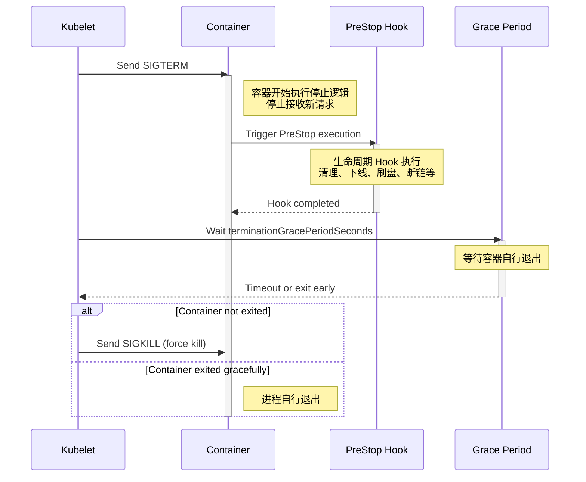
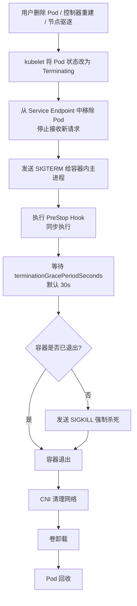

Pod 优雅关闭是指在 Kubernetes 中，当 Pod 因 升级、Eviction、节点漂移、资源不足、故障恢复、策略驱逐 等原因需要被终止时，
kubelet 不会立即强制关闭 Pod，而是尽可能以“优雅”的方式终止容器。

这个过程允许容器在被真正终止前：

- 收到 kubelet 发出的 SIGTERM 信号
- 完成清理逻辑（关闭连接、刷新缓存、写回数据）
- 执行 PreStop Hook
- 在 GracePeriod 内安全地退出

从而最大程度避免数据损坏、连接中断、请求丢失等问题。

## 0x01 Pod 的生命周期

<figure style="text-align: center;">
    
    <figcaption><p style="font-size: 10px; color: rgba(0, 0, 0, 0.5);">Pod Status</p></figcaption>
</figure>

1. Pending：Pod 已提交但尚未调度到 Node，或镜像正在拉取。
2. Running：至少一个容器成功创建并在运行，Pod 处于正常服务阶段。
3. Succeeded / Failed：容器正常退出（退出码 0 为 Succeeded），或运行失败（退出码非 0 为 Failed）。
4. UnknownNode 无法访问，状态不可知。
5. Terminating（不是正式阶段，但非常关键）
   当执行 kubectl delete pod 或 Pod 需要被替换时，kubelet 会将 Pod 标记为 Terminating：

   - Pod 对外不可见
   - Endpoints 会被移除（Service 将不再转流量）
   - 开始进行优雅关闭流程

Terminating 是整个优雅关闭流程的进入点。

## 0x02 Pod 生命周期中的 Hook

Kubernetes 提供了两类生命周期 Hook：

### PostStart

- 容器启动后立即执行
- 不影响容器是否成功启动
- 若执行失败不会回滚容器

适合执行：

- 初始化任务
- 上报启动事件
- 挂载应用动态配置

### PreStop

优雅关闭过程中启动 Hook。

触发时机为：



特点：

- PreStop 是**在 SIGTERM 之后**、**容器退出之前**触发
- 若 PreStop 本身阻塞，则会占满 terminationGracePeriodSeconds
- 必须可快速执行，否则会导致超时被 SIGKILL

适合执行：

- 注销注册中心（Consul、etcd）
- 关闭长连接（gRPC、WebSocket）
- flush buffer / write back cache
- 通知 upstream 下线

## 0x03 Pod 的 Prestop 执行流程

以下是 kubelet 在停止 Pod 时的完整流程梳理：



> PreStop 和 SIGTERM 谁先？
> 先接收 SIGTERM，然后执行 PreStop。
> PreStop 不是 "Pre-SIGTERM"，而是 "Pre-Termination"。

## 0x04 实战：处理 Orphan Pod 问题（以 Ceph PVC 解绑为例）

Source Issue：[ISSUE#60987](https://github.com/kubernetes/kubernetes/issues/60987)

对于开启了 ceph-csi 并设置了 ceph pvc 的 Pod 在删除时，几乎稳定出现如下状况：

- Pod 已被标记为 Terminating
- Ceph RBD / CephFS 卷正在 umount
- kubelet 在 umount 过程中被中断或卡死
- **CephFS 卷卸载未成功**
- Pod 被删除，但文件系统仍被节点占用
- 最终形成 orphaned volume

### 问题成因分析

Kubernetes 优雅关闭流程是：停止容器 → 卸载 Volume → 删除 Pod（etcd）

但 Ceph 等外部存储的 umount 非常脆弱：

- RBD 设备残留
- 有未关闭的文件句柄
- 应用仍在使用挂载点
- 网络抖动导致 OSD 卡顿

若 kubelet 重启或节点压力过高，umount 未完成，产生 orphan。

### 问题解决方案

1. 方法一：手动 umount 清理

    ```shell
    umount /var/lib/kubelet/pods/<pod-uid>/volumes/kubernetes.io~rbd/<volume>
    rbd unmap /dev/rbdX
    ```

2. 重启 kubelet，让其触发 orphan 清理流程
   kubelet 启动后会自动执行：

    ```txt
    orphan pod directories GC
    orphaned device unmap
    orphaned volumes cleanup
    ```

3. 优化应用本身的优雅关闭
   特别是有 Ceph 卷的服务：
   - 必须确保 PreStop 中正确关闭文件句柄
   - 应用不应在 Terminating 阶段继续写入卷
   - 避免长时间的 flush

4. 调大 terminationGracePeriodSeconds（例如 60~120s）

    ```yaml
    spec:
        terminationGracePeriodSeconds: 60
    ```

## 0x05 优雅关闭的最佳实践

1. 设置 PreStop Hook

    ```yaml
    lifecycle:
        preStop:
            exec:
            command: ["/bin/bash", "-c", "sleep 5; myapp --cleanup"]
    ```

2. 设置适当的 `terminationGracePeriodSeconds`
3. readinessProbe + 睡眠退场机制
    确保预先从流量中摘除：

    ```yaml
    lifecycle:
        preStop:
            exec:
            command: ["/bin/sh", "-c", "touch /tmp/stop; sleep 10"]
    ```

应用逻辑监控 `/tmp/stop`，提早停止接收请求。

## 0x06 小结

Kubernetes 的 Pod 优雅关停机制是一个非常重要但容易被忽略的部分，它的核心目的在于：

- 保证服务下线的可靠性
- 减少数据和连接损坏
- 与外部存储（如 Ceph）协调一致
- 避免 Orphan Pod 和挂载泄漏
- 确保 RollingUpdate 平滑无损

理解 shutdown 时序，合理利用 PreStop 与 Grace Period，可以大幅提高集群的稳定性。

---

## Reference

- Kubernetes 官方文档: [Pod Lifecycle](https://kubernetes.io/docs/concepts/workloads/pods/pod-lifecycle/)
- Kubernetes 官方文档: [Container Lifecycle Hooks](https://kubernetes.io/docs/concepts/containers/container-lifecycle-hooks/)
- Kubernetes 官方文档: [Node Shutdowns](https://kubernetes.io/docs/concepts/cluster-administration/node-shutdown/)
- [Issue #60987 Orphaned pod directories due to Ceph volume](https://github.com/kubernetes/kubernetes/issues/60987)
- [Ceph CSI Documentation](https://docs.ceph.com/en/latest/rbd/rbd-kubernetes/)
- [kubernetes/pkg/kubelet/kubelet_pods.go](https://github.com/kubernetes/kubernetes/blob/master/pkg/kubelet/kubelet_pods.go)
- [A Guide to Kubernetes Pod LifeCycle](https://medium.com/%40ollycare/a-guide-to-thekubernetes-pod-lifecycle-dc7992255001)
- [Kubernetes Pod States \| An Introduction](https://bobcares.com/blog/kubernetes-pod-states/)