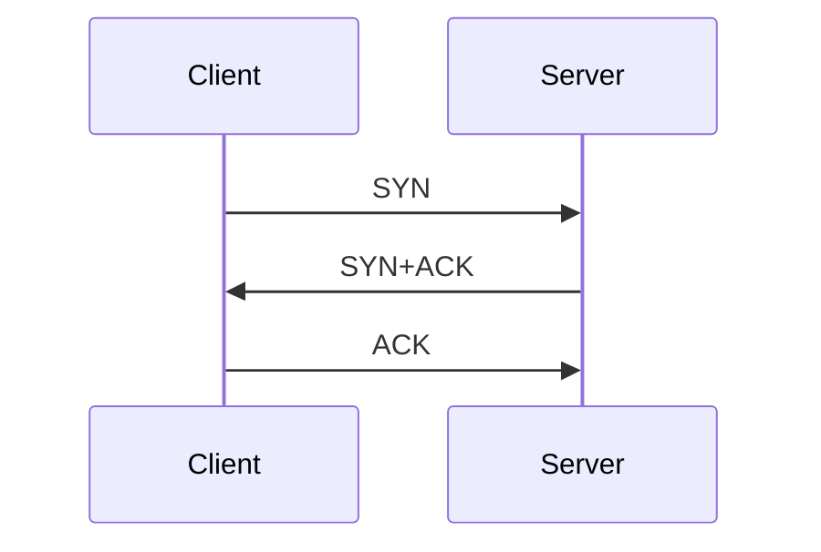
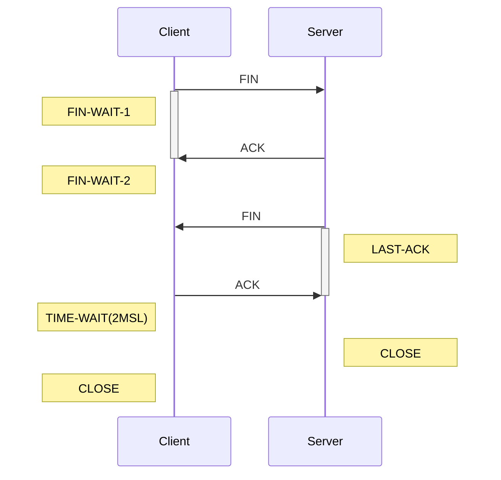

# 0x01 计算机网络基础

## 1. TCP 三次握手与四次挥手

TCP 数据包头部共 20 字节，结构参考下图：

<figure style="text-align: center;">
    
    <figcaption>TCP Header</figcaption>
</figure>

- 0-4   字节：SrcIP / DstIP
- 5-8   字节：**Sequence Number**
- 9-12  字节：**Acknowledge Number**
- 13-16 字节：
  - 13-14 字节：4 offset + 6 Reserved Data + 6 **Signal**
  - 15-16 字节：Window 大小
- 17-20 字节：
  - 17-18 字节：校验和
  - 19-20 字节：紧急指针

13-14 byte 的最后 6 bit 为信号标志位，其中就包括 SYN、ACK、FIN 标志位。

构建 TCP 连接时，三次握手顺序如下，Client 和 Server 都会出一个随机的 **Sequence Number**，ACK 中返回 seq+1 作为 ACK 编码。

### Why Not

> Client 发送的第一个连接请求 SYN1 因网络延迟而滞留，于是 Client 重发了第二个请求 SYN2 并成功建立了连接，数据传输完毕后连接被释放。此时，延迟的 SYN1 才到达 Client...

四次挥手过程如下：

因为 TCP 是**全双工模式连接**，所以双方需各自释放连接。

### Why Not

> 第四次挥手时，客户端发送给服务端的 ACK 有可能丢失，如果服务端因为某些原因而没有收到 ACK 的话，服务端就会重发 FIN，如果客户端在 2*MSL 的时间内收到了 FIN，就会重新发送 ACK 并再次等待 2MSL，防止 Server 没有收到 ACK 而不断重发 FIN...

## 2. TCP 和 UDP 特点和适用场景

协议  是否连接    是否可靠    适用场景
TCP 有连接（三次握手）   有序+重传+拥塞控制  Web、文件传输
UDP 无连接 不可靠，无重传 视频、语音、DNS、DHCP

## 3. 什么是MTU, MSS, Window Scaling, Nagle's algorithm

- MTU（最大传输单元）：以太网一般为 1500 bytes。
- MSS（最大报文段）：TCP 层的数据大小，约为 MTU - 40。
- Window Scaling：TCP窗口放大，支持高带宽延迟网络。
- Nagle 算法：合并小包发送，降低拥塞，延迟更高。

## 4. 简述 DNS 原理，递归 vs 迭代查询

- 递归查询
  - 客户端 → 本地 DNS
  - 请求流程：客户端只发 **一次请求**，要求对方给出最终结果。由 **本地域名服务器 (Local DNS)** 一口气查到最终 IP 并返回。
  - 返回结果：查询成功或查询失败。
- 迭代查询：
  - 客户端 → 本地DNS/向根、客户端 → TLD、客户端 → 权威DNS
  - 请求流程：客户端发出 **多次请求**，对方如果没有授权回答，它就会返回一个能解答这个查询的其它名称**服务器列表**。客户端会再向返回的列表中发出请求，直到找到最终负责所查域名的名称服务器，从它得到最终结果。
  - 返回结果：最佳的查询点 或 主机地址。

```mermaid
sequenceDiagram
    autonumber
    participant Client as 客户端
    participant LDNS as 本地DNS解析器
    participant Root as 根DNS服务器
    participant TLD as 顶级域DNS（.com / .cn）
    participant Auth as 权威DNS服务器

    %% 递归查询路径
    rect rgb(240,240,255)
    Note over Client,LDNS: 🌀 递归查询（本地DNS替客户端完成所有查询）
    Client->>LDNS: 请求 www.example.com 的 IP（递归查询）
    LDNS->>Root: 询问根服务器（.com 在哪？）
    Root-->>LDNS: 返回 .com 顶级域的地址
    LDNS->>TLD: 询问 .com 域（example.com 在哪？）
    TLD-->>LDNS: 返回 example.com 的权威DNS地址
    LDNS->>Auth: 询问 example.com 权威DNS
    Auth-->>LDNS: 返回 www.example.com 的 IP
    LDNS-->>Client: 返回最终 IP 地址
    end

    %% 迭代查询路径
    rect rgb(255,250,230)
    Note over Client,Auth: 🔁 迭代查询（DNS服务器仅返回下一跳）
    Client->>Root: 直接询问根DNS（www.example.com）
    Root-->>Client: 告诉你 .com 顶级域DNS在哪
    Client->>TLD: 继续询问 .com DNS
    TLD-->>Client: 告诉你 example.com 权威DNS在哪
    Client->>Auth: 最后询问权威DNS
    Auth-->>Client: 返回 www.example.com 的 IP
    end
```

## Q5. 什么是 ARP, DHCP, NAT, VLAN, 子网划分

- ARP：IP → MAC 映射，二层通信。
- DHCP：动态分配IP地址。
- NAT：私网 → 公网地址转换。
- VLAN：逻辑隔离二层广播域。
- 子网划分：CIDR 记法（如 192.168.1.0/24）控制主机数与网络规模。

# 0x02 网络性能与调优

## 6. Linux 下如何查看网络连接和延迟

- `ss -tuna` / `netstat -anp`：查看TCP/UDP连接
- `ping`：ICMP往返延迟（RTT）
- `traceroute`：每一跳延迟
- `iperf3`：TCP/UDP 吞吐测试
- `tcpdump`：抓包分析（过滤如 `tcp port 80`）

## 7. 如何排查高 RTT 成因、丢包现象，以及网络拥塞情况？

- `ping` 看波动 & 丢包
- `traceroute` 定位异常出现在哪跳连接
- `iperf` 确认对端吞吐是否正常
- `tcpdump` 确认 TCP 数据包中参数情况，着重看重传次数、窗口大小

**指标关注**：

- RTT 大 → 拥塞或链路延迟
- 丢包高 → 链路质量差 or buffer 溢出
- 窗口小 → 滞后于 BDP，需 window scaling

## 8. 简述 TCP 拥塞控制四阶段和内容

- **慢启动（Slow Start）**：初期指数增长 cwnd，收到一个ack增加一个新窗口。初始拥塞窗口（cwnd）一般为 1~10 个 MSS，每收到一个 ACK，**窗口加倍**（指数增长），快速探测带宽，但风险高。
- **拥塞避免**：线性增长 cwnd。当 cwnd ≥ ssthresh（慢启动阈值）时，进入拥塞避免。每 RTT 增长**线性**（每轮 +1 MSS），稳健但增长慢。
- **快重传**：收到3个重复ACK，立即重传。不等超时，若收到接收方 **3 个重复 ACK**（说明某个包丢了）。立即重发丢失的数据包。
- **快恢复**：减半 cwnd，进入拥塞避免而非重头来。快重传后，说明网络可用，但有拥塞。避免 cwnd 退回 1，减少性能损失。调整策略可以用伪代码表述：
  - ssthresh = cwnd / 2
  - cwnd = ssthresh（或 ssthresh + 3）
  - 进入**拥塞避免阶段**而不是重回慢启动

# 0x03 高频交易中高性能网络优化

## 9. 什么是 busy-polling 和 DPDK

**busy-polling**：CPU轮询收包，跳过中断，提高低延迟能力（可用 `SO_BUSY_POLL`）

**DPDK（Data Plane Development Kit）**：

- 用户态绕过内核协议栈
- 零拷贝 + 多核并发 + 高吞吐
- 适用于高频交易、SDN

## 10. 高频交易网络中的延迟会出现在哪些环节？

```mermaid
sequenceDiagram
    autonumber
    participant UA as 用户应用（User Space）
    participant K as 系统内核（Kernel）
    participant NIC as 驱动 / 网卡（Driver & NIC）
    participant L as 物理链路（光纤/铜缆）
    participant SR as 交换/路由设备（中间节点，若多跳可理解为多台）
    participant RNIC as 远端网卡
    participant RK as 远端内核
    participant RA as 远端应用

    UA->>K: send()/write() 等系统调用
    Note over UA,K: [A] 系统层级延迟：用户态→内核态切换、缓冲拷贝等

    K->>K: TCP/IP 协议栈处理
    Note right of K: [B] 内核层级延迟：TCP/IP 分段、拥塞/流控、路由查找、校验等

    K->>NIC: 报文下发到驱动/NIC
    Note over K,NIC: [C] 驱动/NIC 延迟：驱动排队、DMA、NIC 硬件队列/调度

    NIC->>L: 比特上线
    Note right of L: [D1] 物理传播延迟：≈ 5 μs / km（光纤）

    L->>SR: 入交换/路由设备
    SR->>SR: 设备处理/转发
    Note right of SR: [D2] 交换/路由处理：查表、队列调度、ACL/QoS 等

    SR-->>SR: 排队等待（突发/拥塞时）
    Note right of SR: [D3] 排队延迟（Bufferbloat）

    SR->>L: 出口端口发出
    Note right of L: [D1] 继续传播（若多跳则重复 D1/D2/D3）

    L->>RNIC: 到达远端网卡
    RNIC->>RK: DMA 上送/中断
    Note over RNIC,RK: [C]（对称）远端驱动/NIC 延迟

    RK->>RK: 远端 TCP/IP 协议栈处理
    Note right of RK: [B]（对称）远端内核协议栈延迟

    RK->>RA: 递交到远端应用
    Note over RK,RA: [A]（对称）内核→用户态交付
```

1. 系统层级：用户空间 → 系统内核调用延迟
2. 内核层级：内核协议栈处理延迟，来源于 TCP 和 IP 协议处理
3. 驱动层级：硬件驱动层 → 网卡（NIC）延迟
4. 物理层级：
  - 光纤延迟约 5 μs/km
  - 交换/路由器处理
  - 数据包排队延迟（Bufferbloat）

## 11. 高频交易网络中可以采用哪些方案优化延迟？

上面提到的延迟，每个阶段都有优化策略，

> 绑定 CPU core**
> - **关闭 Nagle**
> - **用 `SO_RCVBUF` / `SO_SNDBUF` 调整 buffer**

---

## Reference

- [TCP 3-Way Handshake Process](https://medium.com/@kusal95/tcp-3-way-handshake-process-1fd9a056a2f4)
- [TCP 三次握手和四次挥手（传输层）](https://javaguide.cn/cs-basics/network/tcp-connection-and-disconnection.html)