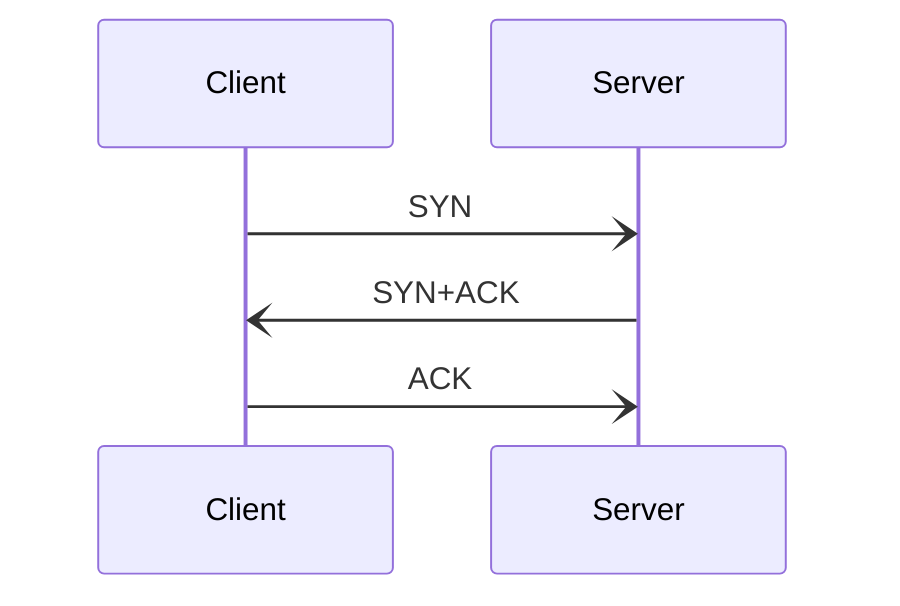
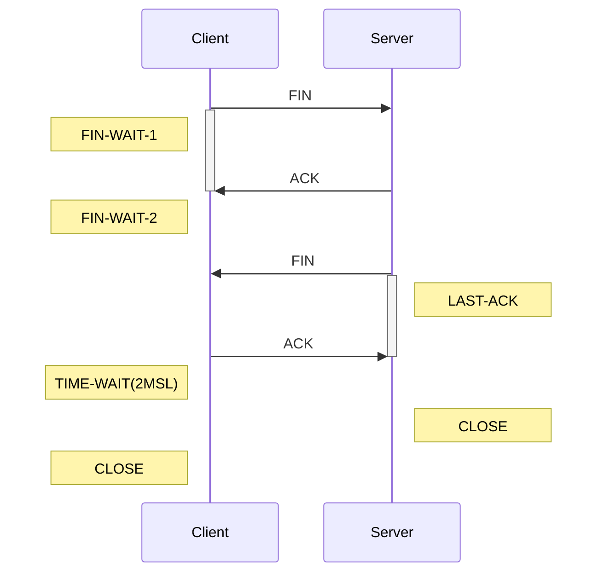
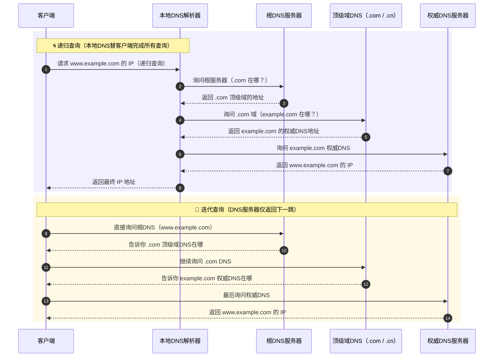

在高频量化公司的面试中，听到的一些网络问题。从最基础的 TCP 三次握手开始，顺势聊到了高频交易中实用的一些网络优化方案。结合后续网上补课看到的一些技术，总结的一下这些题目相关的网络入门知识。

## 0x01 计算机网络基础

### 1. TCP 三次握手与四次挥手

TCP 数据包头部共 20 字节，结构参考下图：

<figure style="text-align: center;">
    
    <figcaption>TCP Header</figcaption>
</figure>

- 0-4   字节：SrcIP / DstIP
- 5-8   字节：**Sequence Number**
- 9-12  字节：**Acknowledge Number**
- 13-16 字节：
  - 13-14 字节：4 offset + 6 Reserved Data + 6 **Signal**
  - 15-16 字节：Window 大小
- 17-20 字节：
  - 17-18 字节：校验和
  - 19-20 字节：紧急指针

13-14 byte 的最后 6 bit 为信号标志位，其中就包括 SYN、ACK、FIN 标志位。

#### 三次握手流程

构建 TCP 连接时，三次握手顺序如下，Client 和 Server 都会出一个随机的 **Sequence Number**，ACK 中返回 seq+1 作为 ACK 编码。

#### Why Not：为什么两次无法结束连接

> 假如将 TCP 三次握手流程改为两次。
> Client 端不需要确认 Server 端第二次握手发送的 SYN 包，直接传输数据。

**BAD CASE** 

假设某个 Client 发送的第一个连接请求 SYN-1 因网络延迟而滞留，Client 因未接到 SYN-1-ACK，选择重发，发送了第二个请求 SYN-2 并成功建立了连接，并在数据传输完毕后释放 FIN-2 构造的连接。

此时，延迟的 SYN-1 才到达 Server 端，Server 端将会正常构造连接，而 Client 无法拒绝错误回应，将会被动产生新连接。

#### 四次挥手流程

因为 TCP 是**全双工模式连接**，所以双方结束连接时，需各自释放连接。

四次挥手过程如下：

#### Why Not：为什么三次无法结束连接

> 假如将 TCP 四次挥手流程改为三次。
> Server 端不等待 Client 端回应第三次挥手请求，直接关闭套接字。

**BAD CASE** 

第四次挥手时，客户端发送给服务端的 ACK 有可能丢失，如果服务端因为某些原因而没有收到 ACK 的话，服务端就会重发 FIN。

如果客户端在 2x MSL 内收到了 FIN，就会重新发送 ACK 并再次等待 2x MSL，防止 Server 没有收到 ACK 而不断重发 FIN...

### 2. TCP 和 UDP 特点和适用场景

| 协议 | 是否连接 | 是否可靠 | 适用场景 |
|---|---|---|---|
|TCP|有连接（三次握手）|可靠、有序、支持重传、拥塞控制| Web、文件传输|
|UDP|无连接|不可靠、不支持重传|视频、语音、DNS、DHCP|

### 3. 什么是 MTU, MSS, Window Scaling, Nagle算法

- MTU（最大传输单元）：物理网中传输的最大单元，包含协议头部及数据，以太网一般为 1500 bytes。
- MSS（最大报文段）：TCP 数据报大小，约为 MTU - 40，即给协议头部留 40 bytes。
- Window Scaling：TCP 窗口调整，支持高带宽延迟网络。
- [Nagle 算法]((https://en.wikipedia.org/wiki/Nagle%27s_algorithm#Algorithm))：合并小包发送，降低发包频率，减少对系统内核造成的载荷花，但会造成更高的平均延迟。

### 4. 简述 DNS 原理，递归 vs 迭代查询

- 递归查询
  - 客户端 → 本地 DNS
  - 请求流程：客户端只发 **一次请求**，要求对方给出最终结果。由 **本地域名服务器 (Local DNS)** 一口气查到最终 IP 并返回。
  - 返回结果：查询成功或查询失败。
- 迭代查询：
  - 客户端 → 本地DNS/向根、客户端 → TLD、客户端 → 权威DNS
  - 请求流程：客户端发出 **多次请求**，对方如果没有授权回答，它就会返回一个能解答这个查询的其它名称**服务器列表**。客户端会再向返回的列表中发出请求，直到找到最终负责所查域名的名称服务器，从它得到最终结果。
  - 返回结果：最佳的查询点 或 主机地址。

### 5. 底层协议：什么是 ARP、DHCP 协议？

- ARP：IP → MAC 映射，二层通信。
- DHCP：动态分配IP地址。

### 6. 子网管理：什么是 NAT, VLAN, 子网划分功能？

- NAT：负责私网 → 公网地址转换。
- VLAN：逻辑隔离二层广播域。
- 子网划分：CIDR 记法（如 192.168.1.0/24）控制子网主机数与网络规模。

## 0x02 网络性能与调优

### 7. Linux 下如何查看网络连接和延迟

- `ss -tuna` / `netstat -anp`：查看TCP/UDP连接
- `ping`：ICMP往返延迟（RTT）
- `traceroute`：每一跳延迟
- `iperf3`：TCP/UDP 吞吐测试
- `tcpdump`：抓包分析（过滤如 `tcp port 80`）

### 8. 如何排查高 RTT 成因、丢包现象，以及网络拥塞情况？

- `ping` 看波动 & 丢包
- `traceroute` 定位异常出现在哪跳连接
- `iperf` 确认对端吞吐是否正常
- `tcpdump` 确认 TCP 数据包中参数情况，着重看重传次数、窗口大小

**指标关注**：

- RTT 大 → 拥塞或链路延迟
- 丢包高 → 链路质量差 or buffer 溢出
- 窗口小 → 滞后于 BDP，需 window scaling

### 9. 简述 TCP 拥塞控制四阶段和内容

TCP 在传输过程中，为了保证稳定传输，所以需要持续探测目前可行的数据窗口大小。

- **慢启动（Slow Start）**：初期指数增长 $cwnd$，收到一个 ack 增加一个新窗口。初始拥塞窗口（cwnd）一般为 1~10 个 MSS，每收到一个 ACK，**窗口加倍**（指数增长），快速探测带宽，但风险高。
- **拥塞避免**：线性增长 cwnd。当 cwnd ≥ ssthresh（慢启动阈值）时，进入拥塞避免。每 RTT 增长**线性**（每轮 +1 MSS），稳健但增长慢。
- **快重传**：收到 3 个重复ACK，立即重传。不等超时，若收到接收方 **3 个重复 ACK**（说明某个包丢了）。立即重发丢失的数据包。
- **快恢复**：减半 cwnd，进入拥塞避免而非重头来。快重传后，说明网络可用，但有拥塞。避免 cwnd 退回 1，减少性能损失。调整策略可以用伪代码表述：
  - ssthresh = cwnd / 2
  - cwnd = ssthresh（或 ssthresh + 3）
  - 进入**拥塞避免阶段**而不是重回慢启动

---

## Reference

- [TCP 3-Way Handshake Process](https://medium.com/@kusal95/tcp-3-way-handshake-process-1fd9a056a2f4)
- [TCP 三次握手和四次挥手（传输层）](https://javaguide.cn/cs-basics/network/tcp-connection-and-disconnection.html)
- [Nagle's algorithm](https://en.wikipedia.org/wiki/Nagle%27s_algorithm#Algorithm)
- [The Nagle Algorithm: A Simple Solution to a Complex Problem](http://lunxunmedium.com/@elouadinouhaila566/the-nagle-algorithm-a-simple-solution-to-a-complex-problem-0c66715663dc)