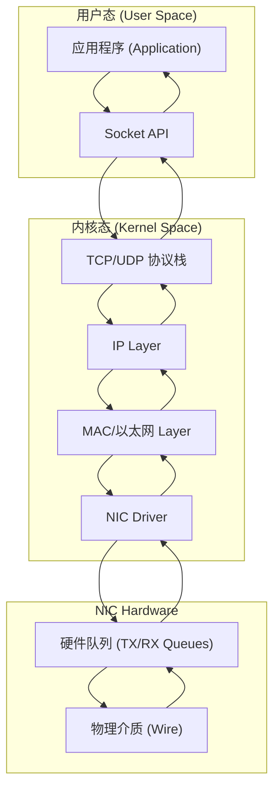
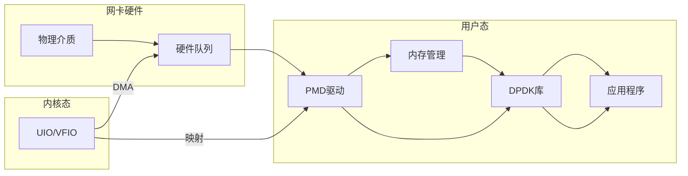
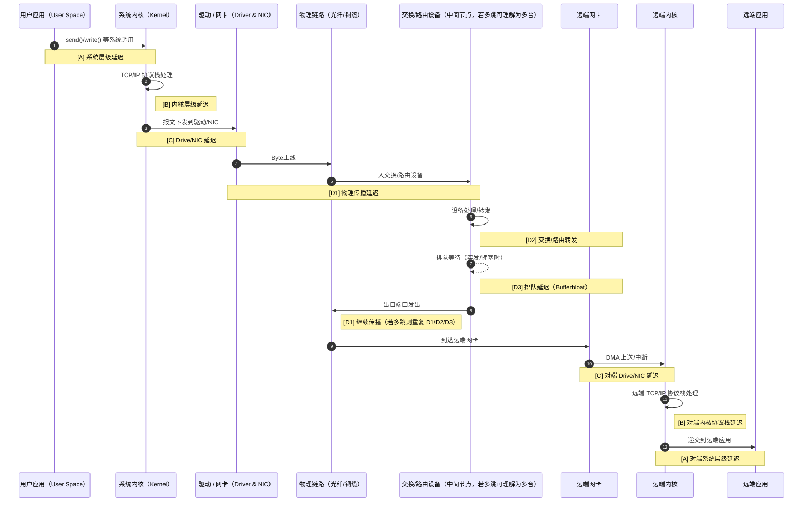

在高频量化公司的面试中，听到的一些网络问题。顺势聊到了高频交易中实用的一些网络优化方案。结合后续网上补课看到的一些技术，总结的一下这些题目相关的网络入门知识。

## 0x03 TCP中有哪些窗口

### 10. 什么是 busy-polling 和 DPDK？

#### 传统网络模型及限制

传统网络模型*(Linux< 2.5.44)*中，一个数据包的发送了流程可以参考下图：



可以看到，一个数据包从用户空间到物理网卡至少要经过**两次**拷贝：

- 第一次拷贝：从用户空间缓冲区 → 内核空间缓冲区
  - 通过 系统调用触发，如`send()`
  - 涉及用户态到内核态的上下文切换
- 第二次拷贝：从内核空间缓冲区 → 网卡DMA缓冲区
  - 内核协议栈处理完成后
  - 通过 DMA 引擎传输，但仍需 CPU 中断

这中间，当来自 User Space 的新数据包到达时，产生一次中断，网卡完成数据发送，产生第二次时中断
此外，每次 Kernel Space 将数据拷贝到 硬件缓冲 都会引发硬件中断，当大量数据包拥堵时，反复中断引发的上下文拷贝，产生大量的冗余消耗，也就是**中断风暴**。

#### 内核旁路技术：以 Intel DPDK 为例



DPDK（Data Plane Development Kit）是一个开源工具包，提供了一组数据平面库和网络接口控制器**轮询模式**驱动程序。

可以将 TCP 数据包的处理，从**内核空间**中转移到**用户空间**中的进程里完成。

DPDK 特点就是：

- 用户态绕过内核协议栈直接访问 NIC Buffer
- 零拷贝 + 多核并发 + 高吞吐
- 适用于高频交易、SDN

#### 优化内核中断机制

**epoll** 机制：在内核空间中，构建epoll对象，每次中断，将只需要保存指定的上下文描述

**busy-polling** 机制：开启忙轮询设置后，CPU 将会在空闲状态下，主动每隔一段时间主动对缓存进行查看。

```c
// 启用socket级别的忙轮询
int enable_busy_poll(int sockfd) {
    int val;
    
    // SO_BUSY_POLL: 当没有数据时，内核轮询驱动的时间(微秒)
    val = 50;  // 50微秒
    if (setsockopt(sockfd, SOL_SOCKET, SO_BUSY_POLL, &val, sizeof(val)) < 0) {
        perror("setsockopt SO_BUSY_POLL");
    }
    
    return 0;
}
```

上面socket级别的忙轮询依然是从用户态发起的，内核级别的忙轮询可以参考下面的配置。

```shell
## 启用内核级别的忙轮询
echo 0 > /proc/sys/net/core/netdev_budget      ## 减少NAPI处理量
echo 1 > /proc/sys/net/core/busy_poll          ## 启用繁忙轮询
echo 50 > /proc/sys/net/core/busy_read         ## 繁忙读取超时(微秒)
```


### 11. 数据包的延迟会出现在哪些环节？



1. **[A]** 系统层级延迟：从 User Space 到 Kernal Space 调用延迟。
2. **[B]** 内核层级延迟：内核协议栈，如 TCP/IP，协议的处理延迟。
3. **[C]** Drive/NIC 层级延迟：硬件驱动层 到 网卡（NIC）造成的延迟。
4. **[D]** 物理层级传输延迟：
   1. **[D1]** 光纤延迟:约 5 μs/km。
   2. **[D2]** 交换/路由器处理延迟。
   3. **[D3]** 数据包排队延迟Bufferbloat。

### 12. 可以采用哪些方案优化延迟？

上面提到的延迟来源，每个阶段都有优化方案。

#### [A] 系统层级延迟优化

- 使用内核旁路 Kernel Bypass 方案绕过 Kernal Space，使用 DPDK 编写发包模块。
- 优化线程的 CPU Affinity ，将关键的进程、线程，物理中断（IRQ），绑定到特定的 CPU Core 上，避免操作系统调度器将系统任务在核心间迁移。从而保证缓存热度、减少上下文切换。`sched_setaffinity` 系统调用来设置线程的CPU亲和性绑定 CPU core。

  ```shell
  ## 在 GRUB 配置中将指定 CPU 隔离：isolcpus=1,2,3
  ## 将 my_program 启动，并将其绑定到核心 2 和 3 上
  taskset -c 2,3 ./my_program

  ## 对于一个已经运行的进程 PID=12345，将其绑定到核心 1
  taskset -pc 1 12345
  
  ## 将中断号90绑定到CPU核心2
  echo 2 > /proc/irq/90/smp_affinity
  ```

#### [B] 内核/协议层级延迟优化

- 关闭 TCP 协议中 [Nagle](http://lunxunmedium.com/@elouadinouhaila566/the-nagle-algorithm-a-simple-solution-to-a-complex-problem-0c66715663dc) 配置
- 使用 `SO_RCVBUF` / `SO_SNDBUF` 调整 socket 缓冲区

  ```c
  // 小缓冲区策略 - 减少数据在内核中的停留时间
  set_socket_buffers(sockfd, 64 * 1024, 32 * 1024); // 64KB接收，32KB发送
  // 大缓冲区策略 - 提高批量传输效率
  set_socket_buffers(sockfd, 4 * 1024 * 1024, 2 * 1024 * 1024); // 4MB接收，2MB发送
  ```

#### [C] Drive/NIC 层级延迟优化

- DPDK 内核旁路模式，User Space 直接从 NIC Buffer 的映射中读取数据。
- 轮询策略优化：
  - `epoll`：使用 epoll 取代 select 和poll 模式，提升内核态处理中断的效率。
  - `busypoll`：使用 `busy_poll` 套接字接口读取数据，牺牲 CPU 性能，换取最快读取时间。
- 缓存优化：
  - 使用巨页（Huge Pages）提高内存访问效率，降低快表（TLB）缺失的概率。

---

## Reference

- [Medium｜What's epoll?](https://medium.com/@avocadi/what-is-epoll-9bbc74272f7c)
- [Google文章｜Busy Polling: Past, Present, Future](https://netdevconf.org/2.1/papers/BusyPollingNextGen.pdf)
- [DPDK Repo](https://github.com/DPDK/dpdk)
- [25-网络协议栈与系统实现：Linux系统](https://www.bilibili.com/video/BV1dtNtzvEPS)
- [26-网络协议栈与系统实现：Intel DPDK](https://www.bilibili.com/video/BV1GQN4zcEXR)
- [Nagle's algorithm](https://en.wikipedia.org/wiki/Nagle%27s_algorithm#Algorithm)
- [The Nagle Algorithm: A Simple Solution to a Complex Problem](http://lunxunmedium.com/@elouadinouhaila566/the-nagle-algorithm-a-simple-solution-to-a-complex-problem-0c66715663dc)